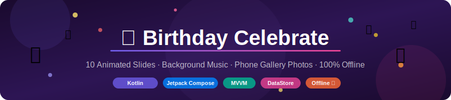
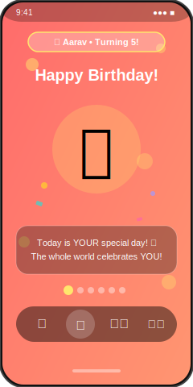
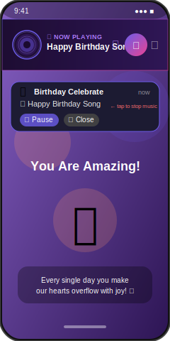
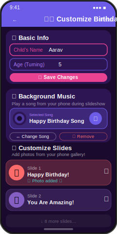

# 🎂 Birthday Celebrate App

<p align="center">
  
</p>

<p align="center">
  
  
  
  
  
  
</p>

> **A beautiful, fully offline birthday slideshow app** — 10 animated slides, photos from your gallery, and background music from your phone. Everything stored privately on your device. No internet. No Firebase. No account needed.

---

## 📱 Screenshots

<p align="center">
  
  &nbsp;&nbsp;
  
  &nbsp;&nbsp;
  
</p>

<p align="center">
  <em>Slideshow Screen &nbsp;&nbsp;&nbsp;&nbsp;&nbsp;&nbsp; Music Player Bar &nbsp;&nbsp;&nbsp;&nbsp;&nbsp;&nbsp; Edit / Customize</em>
</p>

---

## ✨ Features

| Feature | Details |
|---|---|
| 🎠 **10 Animated Slides** | Gradient, sparkle, and polka-dot backgrounds per slide |
| 🎊 **Confetti** | Auto-plays on celebration slides |
| 👆 **Swipe Navigation** | Swipe left/right between slides |
| ▶️ **Auto-Play** | Play/Pause with 3.5s per slide |
| 📸 **Gallery Photos** | Pick any photo from your device for each slide |
| 🎵 **Background Music** | Pick any song (MP3/AAC/FLAC) — loops through slideshow |
| 🔔 **Music Notification** | Play/Pause/Close controls from notification shade & lock screen |
| ❌ **Close Music Anytime** | Tap ✕ in notification to fully stop music and dismiss |
| 💾 **Local Storage Only** | Jetpack DataStore — 100% offline, no cloud |
| 🔒 **Privacy First** | Zero data leaves your device |

---

## 🎵 Music — How It Works

```
User taps "Pick a Song" in Edit screen
          ↓
System audio picker opens (no permission popup needed on Android 13+)
          ↓
Song URI saved to DataStore (remembered on next launch)
          ↓
MusicService starts as Foreground Service
          ↓
Notification appears: 🎵 Song Title  [▶/⏸]  [✕ Close]
          ↓
Music plays through all 10 slides, loops automatically
          ↓
Tap ✕ Close → notification dismissed, service stopped, music off
```

### Notification Controls

| Button | Action |
|---|---|
| ▶️ Play / ⏸ Pause | Toggle playback |
| ✕ Close | **Fully stops music** and removes notification |

> The notification **cannot be swiped away** while music is playing (Android requirement for foreground services). You must tap **Close** to stop it — this is intentional so music doesn't stop accidentally.

---

## 🏗️ Architecture

```
┌─────────────────────────────────────────────┐
│             UI LAYER (Compose)              │
│   SlideshowScreen    EditScreen             │
│        ↕ collectAsStateWithLifecycle        │
├─────────────────────────────────────────────┤
│           VIEWMODEL LAYER                   │
│         BirthdayViewModel                   │
│   StateFlow<BirthdayData>                   │
│   MusicController (owns service binding)    │
│        ↕ suspend fun / Flow                 │
├─────────────────────────────────────────────┤
│          REPOSITORY LAYER                   │
│        BirthdayRepository                   │
│   DataStore Preferences (local JSON)        │
├─────────────────────────────────────────────┤
│    MUSIC SERVICE (Foreground Service)       │
│        MusicService                         │
│   MediaPlayer — plays from content URI      │
│   Notification with Play/Pause/Close        │
└─────────────────────────────────────────────┘
```

**Pattern:** MVVM + Repository + Bound Foreground Service

---

## 📁 Project Structure

```
app/src/main/java/com/birthday/celebrate/
│
├── MainActivity.kt
├── data/
│   ├── BirthdayData.kt          # Data models + default 10 slides
│   ├── BirthdayRepository.kt    # DataStore read/write
│   └── BirthdayViewModel.kt     # State + music controls
│
├── music/
│   ├── MusicService.kt          # Foreground service + notification
│   ├── MusicController.kt       # Service binding bridge
│   └── MusicPlayerBar.kt        # Animated vinyl UI composable
│
├── ui/
│   ├── BirthdayNavGraph.kt
│   ├── theme/Theme.kt
│   ├── components/
│   │   ├── BirthdaySlideCard.kt
│   │   └── SlideBackground.kt
│   └── screens/
│       ├── SlideshowScreen.kt
│       └── EditScreen.kt
│
└── utils/
    └── ConfettiUtils.kt

.github/
└── workflows/
    ├── ci-cd.yml        # Build debug APK on every push
    └── pr-check.yml     # Quality gate on every PR
```

---

## 🚀 Getting Started

### Prerequisites
- Android Studio Hedgehog 2023.1.1 or newer
- Android SDK 26+ (Android 8.0 Oreo)
- JDK 17

### Run Locally

```bash
# 1. Clone
git clone https://github.com/yourusername/BirthdayCelebrateApp.git

# 2. Open in Android Studio
#    File → Open → select BirthdayApp folder

# 3. Sync Gradle (downloads ~80MB dependencies once)
#    Click "Sync Now" in yellow bar

# 4. Run on device or emulator
#    Click ▶️ or press Shift+F10
```

### Build APK from command line

```bash
cd BirthdayApp
chmod +x gradlew
./gradlew assembleDebug
# Output: app/build/outputs/apk/debug/app-debug.apk
```

---

## ⚙️ CI/CD — GitHub Actions

Every push automatically builds a debug APK — **no signing key or secrets needed**.

```
push to main/develop
       ↓
  🔍 Lint check
       ↓
  🧪 Unit tests
       ↓
  🔨 assembleDebug
       ↓
  📱 APK uploaded as artifact (30 days)
```

### Get your APK after each build

1. Go to **Actions** tab in your GitHub repo
2. Click the latest ✅ workflow run
3. Scroll to **Artifacts**
4. Download **`birthday-app-debug`**
5. Unzip → install `.apk` on your phone

### Required secrets: **None** ✅

The debug build uses Android's built-in debug keystore automatically.

---

## 🔒 Privacy

- ✅ **No internet permission** — network calls are impossible at OS level
- ✅ **No Firebase** — zero cloud dependency
- ✅ **No analytics or crash reporting**
- ✅ **Photos** — only the URI you choose is stored, never copied
- ✅ **Music** — only the URI is stored, original file untouched
- ✅ **All data** stored in Android's private app sandbox
- ✅ **Uninstall** removes everything permanently

See [PRIVACY.md](PRIVACY.md) for the full policy.

---

## 🛠️ Tech Stack

| Technology | Purpose |
|---|---|
| Kotlin 2.0 | Language |
| Jetpack Compose | Declarative UI |
| MVVM + Repository | Architecture |
| Jetpack DataStore | Local persistence |
| MediaPlayer | Audio playback |
| Foreground Service | Background music |
| Coil | Image loading from URIs |
| Navigation Compose | Screen navigation |
| Kotlin Coroutines + Flow | Async & reactive state |
| Canvas API | Custom confetti animation |

---

## 📄 License

```
MIT License — Copyright (c) 2025
Free to use, modify, and distribute.
```

---

<p align="center">Built with ❤️ in Jetpack Compose — for every parent who wants to make their child's birthday magical 🎂</p>
